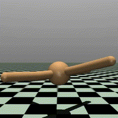
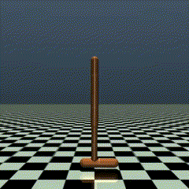
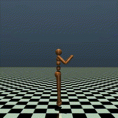
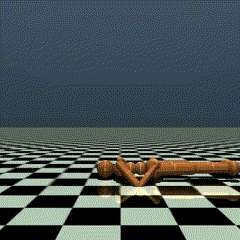
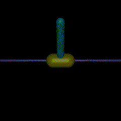
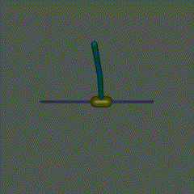
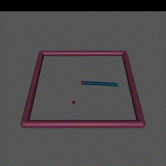
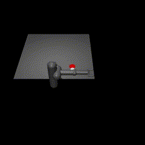
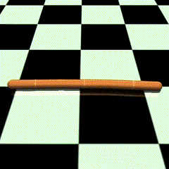
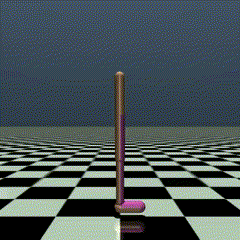

# Tianshou's Mujoco Benchmark

## Video demonstrations

| Ant                                                       | Half Cheetah                                                              | Hopper | Humanoid |
|-----------------------------------------------------------|---------------------------------------------------------------------------|--------|----------|
|  |  |||

| Humanoid Standup                                                      | Inverted Pendulum                                                                   | Inverted Double Pendulum                                                                        | Reacher                                                           |
|-----------------------------------------------------------------------|-------------------------------------------------------------------------------------|-------------------------------------------------------------------------------------------------|-------------------------------------------------------------------|
|  |  |  |  |

| Pusher                                                          | Swimmer                                                           | Walker2d                                                            |
|-----------------------------------------------------------------|-------------------------------------------------------------------|---------------------------------------------------------------------|
|  |  |  |

For each task, we have generated video demonstrations of our pretrained agents and saved the videos in the [demonstrations](./demonstrations) folder.

To generate new videos, simply run the script [demonstrations/demonstrations.py](./demonstrations/demonstrations.py). This will generate new videos for all tasks in all environments in batch.

## Abstract

In this project, we follow the instructions and try to reproduce the results from [Tianshou MuJoCo benchmark](https://github.com/thu-ml/tianshou/tree/master/examples/mujoco). We benchmark 9 Tianshou algorithm implementations in 11 out of 11 environments from [Gymnasium MuJoCo task suite](https://gymnasium.farama.org/environments/mujoco/) provided by Gymnasium.<sup>[[1]](#footnote1)</sup> Essentially, in total we execute `9×11=99` tasks in our experiments.

## Supported algorithms

Supported algorithms are listed below:
- [Deep Deterministic Policy Gradient (DDPG)](https://arxiv.org/pdf/1509.02971.pdf), [commit id](https://github.com/thu-ml/tianshou/tree/e605bdea942b408126ef4fbc740359773259c9ec)
- [Twin Delayed DDPG (TD3)](https://arxiv.org/pdf/1802.09477.pdf), [commit id](https://github.com/thu-ml/tianshou/tree/e605bdea942b408126ef4fbc740359773259c9ec)
- [Soft Actor-Critic (SAC)](https://arxiv.org/pdf/1812.05905.pdf), [commit id](https://github.com/thu-ml/tianshou/tree/e605bdea942b408126ef4fbc740359773259c9ec)
- [Randomized Ensembled Double Q-Learning (REDQ)](https://arxiv.org/pdf/2101.05982.pdf), [commit id](https://github.com/thu-ml/tianshou/tree/dd16818ce4392cd82a44a8450529450dbf759666)
- [REINFORCE algorithm](https://papers.nips.cc/paper/1999/file/464d828b85b0bed98e80ade0a5c43b0f-Paper.pdf), [commit id](https://github.com/thu-ml/tianshou/tree/e27b5a26f330de446fe15388bf81c3777f024fb9)
- [Natural Policy Gradient](https://proceedings.neurips.cc/paper/2001/file/4b86abe48d358ecf194c56c69108433e-Paper.pdf), [commit id](https://github.com/thu-ml/tianshou/tree/844d7703c313009c4c364edb4018c91de93439ca)
- [Advantage Actor-Critic (A2C)](https://openai.com/blog/baselines-acktr-a2c/), [commit id](https://github.com/thu-ml/tianshou/tree/1730a9008ad6bb67cac3b21347bed33b532b17bc)
- [Proximal Policy Optimization (PPO)](https://arxiv.org/pdf/1707.06347.pdf), [commit id](https://github.com/thu-ml/tianshou/tree/6426a39796db052bafb7cabe85c764db20a722b0)
- [Trust Region Policy Optimization (TRPO)](https://arxiv.org/pdf/1502.05477.pdf), [commit id](https://github.com/thu-ml/tianshou/tree/5057b5c89e6168220272c9c28a15b758a72efc32)
- [Hindsight Experience Replay (HER)](https://arxiv.org/abs/1707.01495), [commit id](https://github.com/thu-ml/tianshou/tree/d42a5fb3542ab1db49b051aa4fe24cdbadf842a3)

## Usage
Refer to the [benchmark](./benchmark) folder to reproduce the experimental results.

For each environment, a Jupyter Notebook is available to train 9 Deep Reinforcement Learning algorithms. To reproduce the benchmark, go through the following steps:
1. Create a virtual environment and install all dependencies in it from [requirements.txt](./requirements.txt).
2. Execute all tasks in one notebook, to benchmark 9 DRL algorithms in that specific environment. To best use computational resources, we suggest executing 3 notebooks at a time. Each notebook takes approximately the same time to execute as other notebooks.
3. When execution is complete, multiple details are saved in the notebooks. This includes speed of training, running times for training and testing, best scores etc. Pretrained agents and logs are then saved in [benchmark/log](./benchmark/log) folder and can be monitored with Tensorboard to generate graph plots. 

```bash
$ tensorboard --logdir log
```

## Results
All results in our experiments are saved in the [benchmark](./benchmark) folder.
 - [benchmark/log](./benchmark/log) folder: contains all pretrained agents and logs, which can be plotted with Tensorboard.
 - [benchmark/plots](./benchmark/plots) folder: graph plots generated with Tensorboard.

## Note

<a name="footnote1">[1]</a>  Supported environments include HalfCheetah-v4, Hopper-v4, Swimmer-v4, Walker2d-v4, Ant-v4, Humanoid-v4, Reacher-v4, InvertedPendulum-v4, InvertedDoublePendulum-v4, Pusher-v4 and HumanoidStandup-v4.
